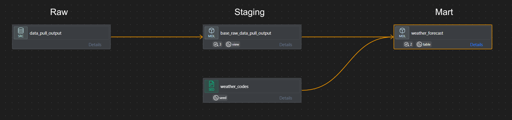

# Data Warehouse and Mart Build: Production ELT Pipeline w/ Weather API Data

## 💡 Problem and Context
**Challenge:**  Weather forecast data changes daily across multiple locations and metrics, requiring an automated pipeline that captures historical forecasts, handles gaps, and produces clean analytics ready tables.

**Solution:** 
* **Pipeline Scope:** Built with Python for extracting and loading, and dbt for transformation. JSON data flows from the Open-Meteo API into a raw schema, through a staging layer for cleaning and deduplication, and into a final mart table for analytics.
* **Data Modeling:** Designed a staging layer for clean up and a mart layer for analytics, with dimension style lookup tables for weather codes and dates.
* **Data Quality:** Implemented dbt tests for null checks, accepted values, and a custom gap detection test that identifies missing city/date combinations.
* **Observability:** Created a central database table that tracks the pipeline's run history logs with run status, duration, row counts, and error messages.

## Tech Stack
- 🐍 **Language:** Python for extraction, loading, and orchestration
- 🦆 **Database:** MotherDuck (OLAP cloud DuckDB) for data warehousing
- 🔄 **Transformation:** dbt Core for staging and mart layer modeling
- 🌤️ **Data Source:** Open-Meteo API for daily weather forecast data
- 📊 **Data Model:** fact + dimension lookup tables
- 🧪 **Data Quality:** dbt tests with custom gap detection and failure storage
- 📝 **Orchestration:** Python subprocess + Windows Task Scheduler for daily runs
- 🔀 **Version Control:** Git/GitHub for versioned pipeline code
- 💻 **Development:** VS Code with dbt Power User extension
- 📋 **Observability:** Pipeline run history logged to MotherDuck with status, duration, and error tracking

## Documentation -
For all the SQL Queries, please refer to this page: [here](/SQL_Queries_Workflow.md)

**dbt Workflow:** 

<!--
[dbt Model](/dbt_model.md)
-->
