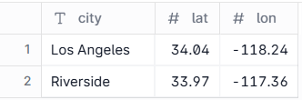
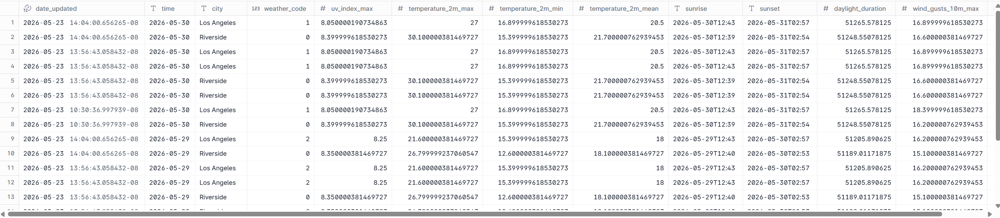
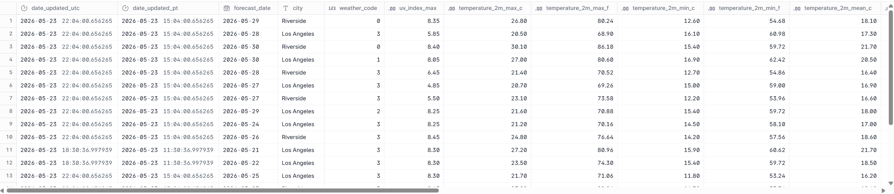
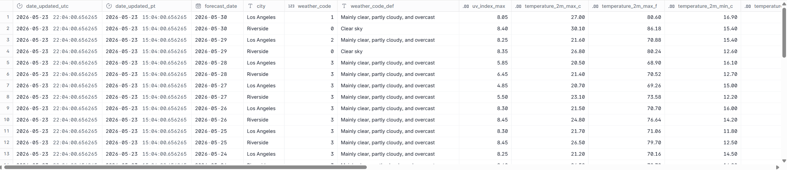
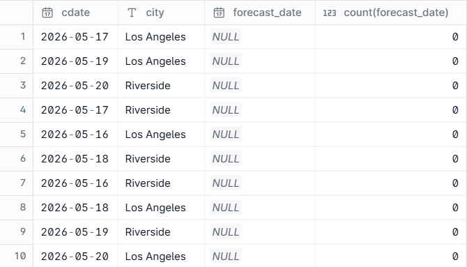
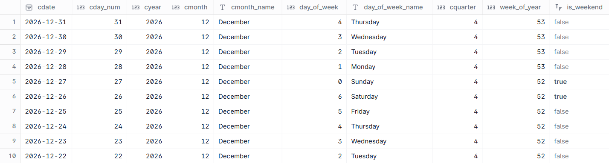
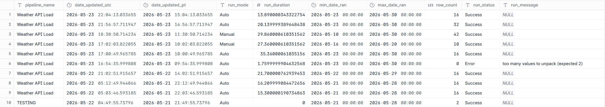

# Here are the SQL queries used for the full pipeline.
## 1. Extract: [extract_data.py](utils/extract_data.py)
These were used to create the locations dimension table, so the script knows what location to pull from the API.
```sql
CREATE OR REPLACE TABLE weather_api.raw.locations(
city VARCHAR,
lat DOUBLE,
lon DOUBLE
);

TRUNCATE weather_api.raw.locations;

INSERT INTO weather_api.raw.locations VALUES
('Los Angeles', 34.04, -118.24),
('Riverside', 33.97, -117.36);

SELECT *
FROM weather_api.raw.locations;
```

## 2. Load: [extract_data.py](utils/load_data.py)
These were used to create the raw schema and table, and then insert the data into the table.
```sql
CREATE SCHEMA IF NOT EXISTS raw;

CREATE TABLE IF NOT EXISTS raw.data_pull_output (
    date_updated TIMESTAMPTZ,
    time VARCHAR,
    city VARCHAR,
    weather_code INTEGER,
    uv_index_max FLOAT,
    temperature_2m_max FLOAT,
    temperature_2m_min FLOAT,
    temperature_2m_mean FLOAT,
    sunrise VARCHAR,
    sunset VARCHAR,
    daylight_duration FLOAT,
    wind_gusts_10m_max FLOAT,
    rain_sum FLOAT
);

INSERT INTO raw.data_pull_output
SELECT *FROM df;

```

## 3. Transform:
* **Staging:** Created UTC/PT fields and Fahrenheit/Celsius fields, rounded metrics to 2 decimal places, and deduped rows by the city and forecast date.

[dbt Staging Step](weather_api_dbt/staging/base_raw_data_pull_output.sql)
```sql
with source as (
        select * from {{ source('raw_weather_output', 'data_pull_output') }}
  ),
  renamed as (
      select
          TIMEZONE('UTC', date_updated) AS date_updated_utc,
          TIMEZONE('America/Los_Angeles', date_updated) AS date_updated_pt,
          CAST("time" as date) as forecast_date,
          city,
          weather_code,
          CAST(uv_index_max AS DECIMAL(10,2)) AS uv_index_max, 
          CAST(temperature_2m_max AS DECIMAL(10,2)) AS temperature_2m_max_c,
          CAST((temperature_2m_max * 9/5)+32 AS DECIMAL(10,2)) AS temperature_2m_max_f,
          CAST(temperature_2m_min AS DECIMAL(10,2)) AS temperature_2m_min_c,
          CAST((temperature_2m_min * 9/5)+32 AS DECIMAL(10,2)) AS temperature_2m_min_f,
          CAST(temperature_2m_mean AS DECIMAL(10,2)) AS temperature_2m_mean_c,
          CAST((temperature_2m_mean * 9/5)+32 AS DECIMAL(10,2)) AS temperature_2m_mean_f,
          CAST(sunrise AS datetime) AS sunrise_utc,
          TIMEZONE('America/Los_Angeles',TIMEZONE('UTC', CAST(sunrise AS datetime))) AS sunrise_pt,
          CAST(sunset AS datetime) AS sunset_utc,
          TIMEZONE('America/Los_Angeles',TIMEZONE('UTC', CAST(sunset AS datetime))) AS sunset_pt,
          CAST(daylight_duration AS DECIMAL(10,2)) AS daylight_duration_sec,
          CAST(daylight_duration / 3600 AS DECIMAL(10,2)) AS daylight_duration_hr,
          CAST(wind_gusts_10m_max AS DECIMAL(10,2)) AS wind_gusts_10m_max_kph,
          CAST(wind_gusts_10m_max / 1.609 AS DECIMAL(10,2)) AS wind_gusts_10m_max_mph,
          CAST(rain_sum AS DECIMAL(10,2)) AS rain_sum_mm,
          CAST(rain_sum / 25.4 AS DECIMAL(10,2)) AS rain_sum_in,
          ROW_NUMBER() OVER (PARTITION BY city, forecast_date ORDER BY date_updated_utc DESC) AS row_num
      from source
  )
  select * from renamed
  where row_num = 1;

SELECT *
FROM weather_api.staging.base_raw_data_pull_output
LIMIT 20;
```

* **Mart:** Joined the staging view with the weather codes dimension table.

[dbt Mart Step](weather_api_dbt/staging/weather_forecast.sql)
```sql
with weather_forecast as (
        select * from {{ ref('base_raw_data_pull_output') }}
  ),
  weather_codes as (
        select * from {{ ref('weather_codes') }}
  ),
  final as(
        select
            f.date_updated_utc,
            f.date_updated_pt,
            f.forecast_date,
            f.city,
            f.weather_code,
            coalesce(c.Description,'Missing Description') AS weather_code_def,
            f.uv_index_max,
            f.temperature_2m_max_c,
            f.temperature_2m_max_f,
            f.temperature_2m_min_c,
            f.temperature_2m_min_f,
            f.temperature_2m_mean_c,
            f.temperature_2m_mean_f,
            f.sunrise_utc,
            f.sunrise_pt,
            f.sunset_utc,
            f.sunset_pt,
            f.daylight_duration_sec,
            f.daylight_duration_hr,
            f.wind_gusts_10m_max_kph,
            f.wind_gusts_10m_max_mph,
            f.rain_sum_mm,
            f.rain_sum_in
        from weather_forecast f
        left join weather_codes c ON c.Code = f.weather_code
  )
  select * from final;

SELECT * 
FROM weather_api.marts.weather_forecast
ORDER BY date_updated_pt desc, forecast_date desc, city;
```

* **dbt Test:** Custom query used in dbt to check for missing forecast days for a list of cities.

[dbt Test Step](weather_api_dbt/staging/check_forecast_dates.sql)
```sql
with date_city as (
SELECT cdate, city
FROM {{ source('dim_date','dim_date') }}
CROSS JOIN(
  SELECT distinct city
  FROM {{ ref('weather_forecast') }}
) cities
WHERE datediff('day', cdate, current_date) between -7 and 7
),
data as (
SELECT *
FROM {{ ref('weather_forecast') }}
WHERE datediff('day', forecast_date, current_date) between -7 and 7
)
SELECT dc.cdate,
       dc.city,
       d.forecast_date,
       count(forecast_date)
FROM date_city dc
LEFT JOIN data d ON dc.cdate = d.forecast_date and dc.city = d.city
WHERE forecast_date is NULL
GROUP BY 1,2,3;
```

## 4. Supplementary:
* **Creating the Dates Dimension Table:** A must have to check for missing data in other tables.
```sql
CREATE OR REPLACE TABLE my_db.main.dim_date (
    cdate date,
    cday_num int,
    cyear int,
    cmonth int,
    cmonth_name string,
    day_of_week int,
    day_of_week_name string,
    cquarter int,
    week_of_year int,
    is_weekend bool
);

INSERT INTO my_db.main.dim_date (
SELECT 
    CAST(date AS DATE)                          AS cdate,
    DAY(date)                                   AS cday_num,
    YEAR(date)                                  AS cyear,
    MONTH(date)                                 AS cmonth,
    MONTHNAME(date)                             AS cmonth_name,
    DAYOFWEEK(date)                             AS day_of_week,
    DAYNAME(date)                               AS day_of_week_name,
    QUARTER(date)                               AS cquarter,
    WEEKOFYEAR(date)                            AS week_of_year,
    CASE WHEN DAYOFWEEK(date) IN (0,6) 
         THEN true ELSE false END               AS is_weekend
FROM (
    SELECT UNNEST(range(
        DATE '2024-01-01', 
        DATE '2027-01-01', 
        INTERVAL '1 day'
    )) AS date
));

SELECT *
FROM my_db.main.dim_date
ORDER BY cdate DESC
LIMIT 10;
```

* **Run History Log:** Created to hold details of each script run, which can be used across multiple processes. Made a custom view to convert timezones.
```sql
CREATE OR REPLACE TABLE my_db.main.run_history_log (
  pipeline_name VARCHAR,
  date_updated_utc TIMESTAMPTZ,
  date_updated_pt TIMESTAMPTZ,
  run_mode VARCHAR,
  run_duration FLOAT,
  min_date_ran DATETIME,
  max_date_ran DATETIME,
  row_count INTEGER,
  run_status VARCHAR,
  run_message VARCHAR,
);

CREATE OR REPLACE VIEW my_db.main.v_run_history_log AS
SELECT 
  pipeline_name,
  TIMEZONE('UTC',date_updated_utc) AS date_updated_utc,
  TIMEZONE('America/Los_Angeles', date_updated_utc) AS date_updated_pt, 
  run_mode,
  run_duration,
  min_date_ran,
  max_date_ran,
  row_count,
  run_status,
  run_message
FROM my_db.main.run_history_log;

SELECT *
FROM my_db.main.v_run_history_log
ORDER BY date_updated_pt DESC
LIMIT 20;
```

